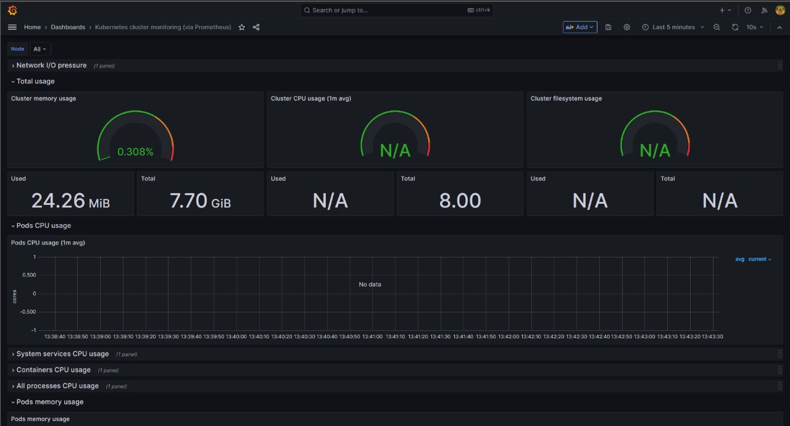
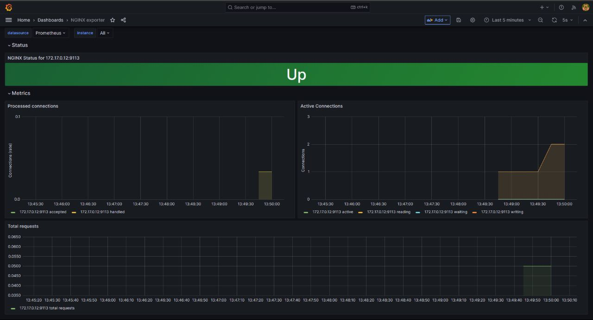

# Production-Grade WordPress Application

This assignment deploys a production-grade WordPress application using Kubernetes. The WordPress application gets proxied through NGINX and uses MySQL as a backend. The "apply" process gets carried out using Helm Charts. Further, we use Prometheus and Grafana to monitor cluster metrics and NGINX metrics. The monitoring infrastructure is also deployed using Helm Charts.

## Usage

**Note:** The WordPress Application gets deployed in `my-sample-namespace` namespace, and Prometheus and Grafana get deployed in `monitoring` namespace.

```bash
helm install wordpress wp-assignment/ -n my-sample-namespace 
helm install prometheus monitoring-release/prometheus -n monitoring 
helm install grafana monitoring-release/grafana -n monitoring 
```

### Uninstall

```bash
helm uninstall wordpress -n my-sample-namespace 
helm uninstall prometheus -n monitoring 
helm uninstall grafana -n monitoring 
```
### Alternatively
```bash
./script.sh install
./script.sh uninstall     
```
## File Structure:
```
assets/

docker-images/
    - Dockerfile.mysql
    - Dockerfile.nginx
    - Dockerfile.wp

monitoring-release/
    grafana/
        <grafana helm chart>
    prometheus/
        <prometheus helm chart>

wp-assignment/
    <wordpress application helm chart>
```

## WordPress Application Architecture
Since our application is divided into 3 parts: WordPress, MySQL and NGINX, let us discuss each component individually to get a deeper understanding.

### NGINX

#### Dockerfile: `./docker-images/Dockerfile.nginx`.

In the NGINX Dockerfile, we have a 2-stage Docker build. In the first stage, we build a custom OpenResty installation from the source code, installing only the modules we require. 

In the second stage, we copy our custom OpenResty installation from the build stage to the production environment, handle logging configurations and specify an entrypoint which utilizes our OpenResty Installation.

**NOTE:** An extra module, `http_stub_status_module` was added to our OpenResty configuration to establish a monitoring endpoint for NGINX.

This Docker image is built and pushed to [Docker Hub](https://hub.docker.com/repository/docker/varxn/k8s-nginx).

#### Kubernetes manifest: `./wp-assignment/templates/nginx.yaml`.

For NGINX, we use the following Kubernetes components:
1. Deployment
   
   In our NGINX Deployment, we configure our ReplicaSet so that we have 3 pods running NGINX. We also add `annotations` to our pods so that Prometheus can scrape the pod.
   
   We have `nginx-exporter` as a sidecar container running in each NGINX pod. That means there are two containers running in each pod: nginx, nginx-exporter.

2. Services
   
   For NGINX, we create 2 services. One that for node-exporter, and one for NGINX. The **NGINX service acts as a NodePort** service, while the node-exporter service is internal service.

3. ConfigMap
   
   We create a ConfigMap for that stores our NGINX configuration. This ConfigMap is mounted on our NGINX pod into a file. 


### MySQL
#### Dockerfile: `./docker-images/Dockerfile.mysql`

In the MySQL Dockerfile, we simply specify our base image.

#### Kubernetes manifest: `./wp-assignment/templates/sql.yaml`.
  
For MySQL, we use the following Kubernetes components:

1. Secret

    We create a secret which stores sensitive data, encoded in base64. In our secret for MySQL, we have the following values:
    - root password
    - database
    - user 
    - password
    - host (actually points to MySQL's service.)

2. PersistentVolumeClaim

    We provision a PersistentVolumeClaim for MySQL using which our database pods can have access to persistent data.

3. Deployment

    **NOTE:** Since MySQL is stateful and relies on its data, the correct way to deploy MySQL is through a StatefulSet. Since I was instructed to use `ReadWriteMany` PersistentVolumeClaim, I went ahead with a Deployment, since in the case of a StatefulSet, the access mode of a PersistentVolumeClaim should **always** be `ReadWriteOnce`.

    In our MySQL deployment, we pass in Environmental Variables which point to our Secrets to configure the database instance, root and user credentials. We also bind a PersistentVolume to the deployment, which is referred by the PersistentVolumeClaim.

4. Service

    For MySQL, we create an internal service that makes the database accessible internally.


### WordPress
#### Dockerfile: `./docker-images/Dockerfile.wp`

In the WordPress Dockerfile, we simply specify our base image.

### Kubernetes manifest: `./wp-assignment/templates/wp.yaml`

For WordPress, we use the following Kubernetes components:

1. ConfigMap

    We create a ConfigMap for WordPress that contains the endpoint of our DB host, i.e. MySQL service.

2. PersistentVolumeClaim
   
   We provision a PersistentVolumeClaim for WordPress using which our application pods can have access to persistent data.

3. Deployment

    In our WordPress deployment, we pass in Environmental Variables which point to our Secrets and ConfigMap and get DB user credentials, DB host, etc. We also bind a PersistentVolume to the deployment, which is referred by the PersistentVolumeClaim.

4. Service

    For WordPress, we create an internal service that makes the application accessible internally.


## Monitoring using Prometheus and Grafana

I used public Helm Charts to achieve monitoring of our Kubernetes cluster and NGINX metrics. Here are some screenshots:

Kubernetes cluster metrics: (Minikube)


NGINX metrics:


**NOTE:** Grafana Dashboards auto-import needs some working on. JSON files for dashboards are located in `./monitoring-release/grafana/dashboards`.
